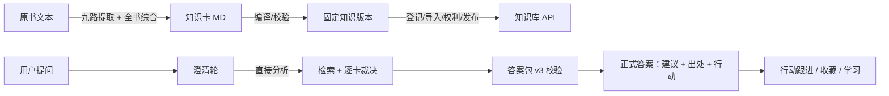

# 第二大脑 · Second Brain

> 把一本书蒸馏成可追溯的知识卡，让 AI 用书里的观点回答你的真实问题——**每个答案都有出处**。


**Second Brain** 是一个开源的「个人知识库 + 可审计 AI 问答」全栈项目：

- **蒸馏管线**：把整本书逐章提取为结构化知识卡（概念/命题/原理/方法/案例/反例等九类），每张卡绑定**逐字原文锚点**，可回溯到出处
- **知识库**：版本化发布（完整指纹校验），支持书籍、卡片、关系图谱与原文证据的只读浏览
- **可审计问答**：AI 回答你的真实问题前会先澄清背景，然后检索知识、逐卡裁决、交叉验证，产出**带引文许可与来源清单**的正式答案
- **Web 应用**：账号体系（注册邀请/二次验证/找回）、问题档案、对话澄清、行动与收藏、学习练习、隐私与数据导出
- **手帐风格界面**：暖纸底、白卡呈现、卷发小馆员 IP（女生/男生版可切换），桌面与手机自适应

## 它解决什么问题

让 AI 读一本书回答问题很容易，但答案经常「编」——

Second Brain 的思路是把信任链拆开：

1. **先蒸馏**：书 → 知识卡，每张卡声明「作者主张 / 转述他人 / 系统推断」，并附能逐字定位的原文锚点
2. **再固定**：知识卡通过完整性指纹校验后**版本化发布**，分析期间内容不可变
3. **后引用**：AI 回答时只能使用给定候选卡与证据，引文必须与原文逐字一致，系统综合必须显式标注——两次结构校验不过就拒绝出答案

所以它给出的每个建议，你都能点回「哪本书、哪张卡、哪句原文」。

## 架构总览



- `web/` React + Vite 前端（问题档案、对话、答案、书房、学习、账号、管理端）
- `server/` Django + DRF 服务端（账号/会话、知识授权、问题与消息、租约 worker、逐调用记账、正式答案发布；PostgreSQL + 行级安全）
- `src/` 领域核心（纯 Python：知识卡加载校验、检索、可审计调用会话与答案包，被服务端以只读适配器调用）
- `prompts/` 答案编排提示词（v3：显式采用边界 + 逐字引文校验）
- `schemas/` 知识卡、答案包、证据等版本化 JSON Schema
- `skills/` 问答 Skill（澄清方法论 Grilling 等）
- `tools/` 开发运维脚本（数据库引导、OpenAPI 类型生成等）
- `docs/` 设计文档、验收记录、管理手册

## 快速开始

### 环境要求

- Python 3.12、Node.js 20+、PostgreSQL 16
- 一个 OpenAI 兼容的对话模型端点（DeepSeek / 豆包 / GLM 等均可，配置见下）

### 1. 知识库 CLI（无需数据库）

```bash
python3.12 -m venv .venv-mvp && .venv-mvp/bin/pip install -r requirements-mvp.lock.txt
.venv-mvp/bin/python -m src.interfaces.cli books                       # 看书目
.venv-mvp/bin/python -m src.interfaces.cli search '如何减少用时间换钱' --mode keyword
```

仓库自带 `examples/sample-library`（自编示例知识集）；`--library examples/sample-library` 即可体验，无需真实书籍。

### 2. Web 产品（服务端 + 前端）

```bash
# 数据库引导：自动创建开发实例并生成 .runtime/product.env
.venv-product/bin/pip install -r server/requirements.lock.txt   # 或先创建 .venv-product
.venv-product/bin/python tools/dev/product_db.py init            # 见 tools/dev/README.md

set -a; source .runtime/product.env; set +a
.venv-product/bin/python server/manage.py migrate --settings=config.settings.migrate

# 模型接入（任选一家 OpenAI 兼容端点）
export SB_MODEL_MODE=provider
export SB_MODEL_NAME=your-model-name
export SB_MODEL_BASE_URL=https://your-endpoint/v1
export SB_MODEL_PROVIDER=openai-compatible
export SB_MODEL_API_KEY=your-key

.venv-product/bin/python -m uvicorn config.asgi:application --app-dir server --port 8019 &
.venv-product/bin/python server/manage.py runworker &             # 澄清/分析任务处理
cd web && npm install && npm run dev                              # http://127.0.0.1:5173
```

知识进入产品需走管理链路：**登记来源 → 技术导入 → 权利审核 → 发布 → 对用户授权**（见 [docs/admin-guide.md](docs/admin-guide.md)）。

### 3. 测试

```bash
.venv-product/bin/python server/manage.py test server.tests --top-level-directory server --settings=tests.integration_settings
cd web && npm test
```

前端 197 项 + 服务端 310 项测试覆盖账号、授权、任务租约、答案校验与主要交互流。

## 安全与隐私设计

- 账号：注册邀请制、可选 TOTP 二次验证、恢复码、登录限流；管理员与普通账号完全隔离
- 数据：PostgreSQL **行级安全**（RLS）按属主隔离；隐私页提供导出、回收站、冷静期注销
- 知识：固定版本指纹校验、按书授引文长度许可、无授权不出原文
- 模型：服务端统一配置端点与密钥，用户请求不可注入模型地址；每次调用独立记账

## 内容与版权说明

本仓库开源的是**代码框架、提示词与自编示例**。仓库不含任何原书正文；`examples/` 为自编示例知识集。由使用者自行蒸馏的书籍知识卡与短引，版权归原作者所有，仅限个人学习研究使用，请遵守当地法律并尊重版权。

## 路线图

- [ ] 蒸馏提示词 v2：案例卡四段叙事、条件/边界必填、更厚的原理解释
- [ ] 语义检索（向量索引）与关键词检索混合
- [ ] 多书综合分析、跨作者对照
- [ ] 移动端 PWA

## 文档

| 文档 | 内容 |
| --- | --- |
| [docs/product-design.md](docs/product-design.md) | 产品设计与边界 |
| [docs/architecture.md](docs/architecture.md) | 架构 |
| [docs/development.md](docs/development.md) | 开发指南 |
| [docs/admin-guide.md](docs/admin-guide.md) | 管理员手册（MFA、知识发布、模型配置） |
| [docs/usage.md](docs/usage.md) | CLI 与调用方式 |
| [docs/distillation-workflow.md](docs/distillation-workflow.md) | 蒸馏工作流 |

## License

代码以 [MIT](LICENSE) 发布。书籍知识卡与短引内容不属于本仓库许可范围，版权归原作者。
