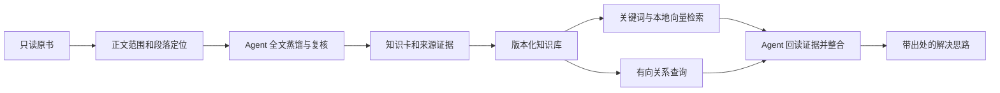

# 《纳瓦尔宝典》单书 MVP 验收

验收时间：2026-09-05 21:27（北京时间）。结论：**本地单书功能闭环通过，可以开始真实试用；尚不是已验证的批量、多作者产品。**

知识版本：`138e911ba4d4581b71d1c09c`。原书只读且 SHA-256 与初始盘点一致；没有安装到全局 Agent、公开发布或设置付费模型 API。

## 实际产物

| 项目 | 已完成 |
| --- | --- |
| 阅读范围 | 财富、判断力、幸福、自我救赎、哲学五章，以及本人 2008/2016 写作 |
| 完整阅读 | 1,031 段；46 个纳入标题节点，其中 45 个有正文、1 个结构标题 |
| 排除记录 | 16 个标题节点；包括前置序言、书单、致谢等范围 |
| 知识库 | 109 张卡：42 方法、37 主张、16 定义、8 反例、6 案例 |
| 证据 | 776 条被引用段落；装配时逐字核对原书，保留原书指纹和字符范围 |
| 图谱 | 79 条有向边，其中 54 条标记 source、25 条标记 inference；可查询方向与有限跳数 |
| 仓颉方法 | 7 个候选中批准 4 个，另 3 个保留知识卡；1 个作者入口 |
| 查询 | books、search、knowledge、evidence、related 五项 CLI；关键词、本地向量和混合模式 |
| 处理工具 | prepare、assemble、complete、validate、publish、bundle、author-skill、package |
| Skill | 通用 second-brain + 单书 naval-almanack；作者入口可查询完整库 |

方法与知识卡类型不是同一口径：42 张 method 卡可以包含系统编排的应用步骤；只有 4 项通过本轮仓颉方法筛选。没有两种独立情境支持的候选不会仅凭两段重复文字晋级。

## 蒸馏与质量边界

三组分别完整阅读 369、186、476 段，采用框架、原则、案例、反例和术语五个视角。根 Agent 抽样回读 12 张知识卡并回读全部晋级候选的指定证据。该过程是 Agent 阅读、自检与抽样复核，**没有完成独立人工逐卡语义审计**。

保留第三方署名、作者亲历与假设的差异；例如幸福与基因的强表述与后文承认基因和环境影响并存，没有合并成单一确定结论。部分原始 Markdown 有 OCR 句序问题，已在相关卡片标注。引用没有可靠页码，使用章节及段落 ID。

source 关系指蒸馏者认为有正文支持，并不表示作者原文包含该图谱术语。当前关系主要在章节组内，跨组关系与重复概念的统一仍有改进空间。

## 检索复测

开发阶段先用 10 题观察原始召回，发现常见词误配和概念召回不足，增加混合相关性门槛及 Skill 问法扩展。随后固定另一组 10 题，运行后没有再调这组标签、问题或检索实现。

| 方式 | 相关题前五命中 | 超范围题返回空结果 |
| --- | --- | --- |
| 关键词 BM25 | 4 / 8 | 0 / 2 |
| 本地语义向量 | 7 / 8 | 1 / 2 |
| 混合检索 | 7 / 8 | 1 / 2 |
| 混合 + 预先写定的问法扩展 | 7 / 8 | 1 / 2 |

这是同一开发方设题的小样本召回检查，不是独立盲测，也不是问答准确率。扩展在开发题“事务外包”上改善召回，但在本组复测没有增加前五命中数。

保留两项失败：团队考核扭曲题没有把委托代理卡排进前五；C++ 协程实现题误命中代码杠杆卡。**Agent 仍需核对支持程度，不能用非空结果自动生成答案。**

模型使用本地 FastEmbed + `BAAI/bge-small-zh-v1.5`，512 维 CPU 推理。初次下载模型文件，文本不提交 Embedding API。索引签名包含知识文本、FastEmbed 版本及模型文件指纹；损坏缓存自动重建。模型选择依据见 [FastEmbed 官方模型清单](https://qdrant.github.io/fastembed/examples/Supported_Models/)。

## 真实 Skill 行为

独立 Agent 完成 4 题、33 次真实 CLI 回执：

- 嫉妒题：仓颉方法路由没有覆盖，项目 Skill 查询完整库并引用整个人生交换观点。
- 幸福基因题：回读相反措辞，不把作者观点改造成对不幸福者的责备。
- 独立设计题：连接需求与杠杆，具体试用行动明确为系统推导。
- 技术越界题：检索仍误配，但 Agent 拒绝把 C++ 实现伪托纳瓦尔。

基线 Agent 只使用仓颉编译入口和引用卡，前两题诚实说明该入口资料不足，第三题可回答杠杆方法。项目适配扩大了可检索知识覆盖；此比较不证明所有回答优于仓颉，也没有运行普通无 Skill 模型的全面对照。

完整可读回答见 [问答示例](mvp-answer-examples.md)。这 4 题是行为观察，不能替代真实用户长期试用。

## 工程和交付验证

15 项测试通过，覆盖来源变化、CRLF、重复标题、来源越界、损坏引用、案例归属、关系方向、空库、发布失败保留旧库、幂等任务、通用书籍命名空间、向量缓存损坏和打包边界。语法检查、pip check、仓颉 doctor、两个 Skill 格式检查通过。

独立代码审查提出 3 个实际缺陷：CRLF 导入失败、origin/案例跨记录校验缺失、损坏向量缓存无法重建。均已修复；独立复核再次运行 15 项测试，并验证修改候选后 complete_job 拒绝登记。

[本地试用包](../dist/second-brain-naval-mvp-20260905.zip)：992 个文件，1,140,348 字节；包含显式选定的真实知识、证据汇编、两个 Skill、源码、提示词、必要文档及仓颉依赖。原书快照、本机配置、开发任务、模型缓存、虚拟环境和 .git 均未打包。

包 SHA-256：`19fadd6418caed56c1b57735ac6fd71ade8ea4c3e208609611f364b54a398b58`。

在 macOS arm64 上创建全新 Python 3.12 环境并安装锁定依赖，解包到独立程序目录，初始化外部用户库，运行五项 CLI、仓颉 doctor 和混合查询；模拟切换到第二个程序目录，CURRENT 与私有标记仍保留。混合查询显式复用已下载模型缓存。尚未验证 Windows/Linux 部署。

## 可重复执行与剩余阶段

最终任务：`ff8d1d3f7ae0ee2d4ee924d8`，状态 completed；prepare/complete 的同输入复用已验证，complete 通过重新装配比对候选。Agent 使用量不可从当前任务接口准确计量，input_tokens/output_tokens/cost 记录 null；不把未知成本写成零。

复用流程见 [蒸馏工作流](distillation-workflow.md)。后续优先让用户用自己的问题试用并补失败集，再引入第二位作者。多书快照合并、跨书图谱、自动队列调度/预算、失败单元自动重试、多人综合尚未实现或验收；publish 当前切换完整快照，不代表追加一本书。

## 原始记录位置

- `data/jobs/naval/mvp-final-evidence.json`：来源、统计与完成状态。
- `data/jobs/naval/retrieval-initial.json`、`retrieval-holdout.json`：初始与固定题集结果。
- `data/jobs/naval/skill-baseline.json`、`skill-acceptance.json`：两种入口的实际答复与调用。
- `data/jobs/naval/promotion-review.json`：方法批准与未晋级理由。
- `data/jobs/naval/package-check.json`、`package-smoke.json`：包校验和独立环境回执。

运行记录含本机路径，属于本地开发资料，不随试用包分发。
