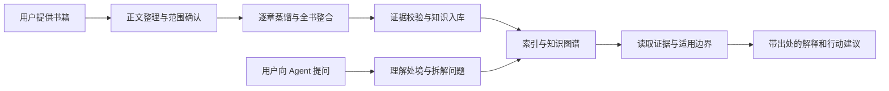

# 第二大脑产品设计

日期：2026-09-05。状态：用户已确认产品组成与项目组织方向；本文件将已讨论内容落为可实施设计。

## 目标

用户向自己的 AI Agent 提出真实问题，Agent 从书籍知识库检索相关观点与方法，结合用户处境给出带出处的建议。用户也能通过蒸馏工具导入自己的书，逐步积累知识资产。

最终产品包含全书深度蒸馏、知识图谱和多个作者 Agent。先完成一本书、一个作者知识代理的完整闭环，再验证跨作者协作。

## 产品边界

1. **知识库**：书籍元数据、全书及章节档案、知识卡片、可执行方法、关系和原文证据。
2. **蒸馏工具**：以仓颉为基础，补充全书覆盖记录、正文范围控制和统一入库适配。
3. **查询工具**：书目查询、观点检索、关系展开、证据读取；CLI、MCP 等调用入口共享同一领域接口。
4. **Agent Skill**：问题澄清、检索规划、证据核对、多观点综合、行动建议与引用规则。

网页界面、支付、云端账号和自动批量调度不属于第一阶段。

## 用户流程

## 全书蒸馏定义

- 所有纳入范围的正文章节都有状态：已处理、待处理、失败或有理由排除。
- 排除序言、推荐语、版权页和营销内容；附录按是否承载正文知识逐项决定。
- 全书覆盖不等于每段都生成卡片。一般知识、案例和术语可以入库，但不必升级为可执行方法。
- 每个观点绑定可定位的原文；章节总结、作者框架和关系均可回溯到支持材料。
- 区分作者主张、正文引用、案例、反例与系统推断。
- 不用“出现次数多”代替重要性判断；只出现一次的关键观点仍可入库。

## 作者 Agent

第一本书形成“基于该作者这一本书的知识代理”，不能宣称已经覆盖作者全部思想。作者 Agent 共享分析流程，使用独立作者配置和可追溯知识。编著者与主要观点人物可分别记录，例如《纳瓦尔宝典》的埃里克·乔根森与纳瓦尔。

多作者阶段需要保留一致、分歧与适用条件，不强行投票形成共识，不制造作者第一人称原话。

## 数据与交付

开发目录保存原书引用、规范化正文、任务缓存和调试资料。交付内容由源码和显式选定的知识库构建，不维护第二套手工修改的产品文件。

- 默认示例库为本项目自编的少量测试材料。
- 用户私有书库与产品安装目录分开；升级只更新程序、Skill 和工具。
- 观点需要证据片段及位置。完整原书可保留在用户本机并按需定位，不能只交付无来源的摘要。
- 搜索索引可重建；修改向量模型无需重新蒸馏书籍。

## MVP 验收

以《纳瓦尔宝典》作为建议首本，运行前检查正文范围与本地版本。该选择是实施默认值，可由用户更换。

1. 导入一本完整书籍并记录书名、观点人物、编著者及正文指纹。
2. 正文范围内章节状态无未解释缺口；所有入库知识有来源。
3. 逐条引用能在同一版本正文定位；推断与原文明确分开。
4. 图谱关系有类型、方向、依据，并能用于补读条件或相邻观点。
5. Agent 通过真实问题找到知识，解释适用性并给出可执行建议。
6. 无答案、错误作者归属、书中反例、上下文不足等题型不会诱发编造。
7. 中断后续跑，已完成章节不重复消耗；失败单元可以单独重做。
8. 记录实际模型、提示词版本、调用量、耗时与可取得的费用；不可取得的费用填“未知”。

只有以上真实单书证据齐备，才能称为 MVP 通过；自编示例与静态格式检查仅证明基础工具工作。
